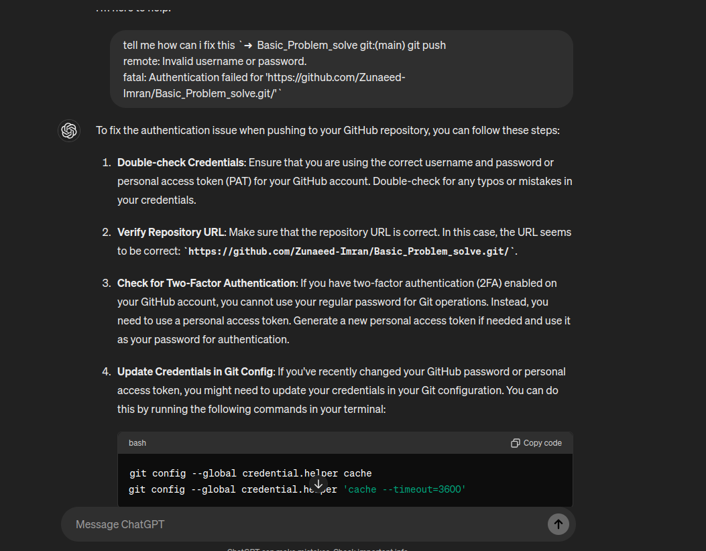
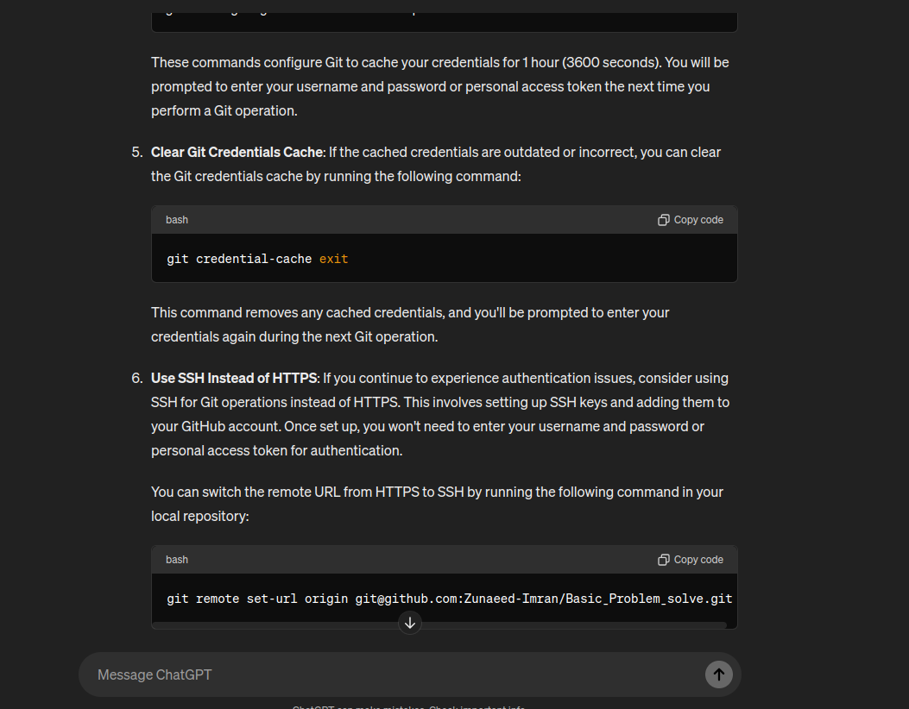

## Learning Git_hub on Terminal.

1. This command Will Show the list of current file.
- `ls`
2. This Command Will Open VS_Code.
- `code .`
3. This command will create a file.
- `touch new.php`
4. This Command will show the the file in terminal.
- `cat file.html`
5. This command can edit the file from the terminal.
- `vim file_name.php`
6. This command can see the git status.
- `git status`
7. This command will add file on vs code what we just written new.
- `git add file_name.php`
8. This command is use To add a Git commit message to your commit.
- `git commit -m "master"`
9. This command will push the branch.
- `git push origin master`
10. This Command will show present working Directory.
- `pwd`
11. This command will show the user name
- `whoami`
12. This command will cler the terminal
- `clear`
13. This Commad will remove the git origin
- `git remote remove origin`
- Now, you can add a new origin url by using the following command.
- `git remote set-url origin git@github.com:Zunaeed-Imran/REPONAME.git`
- If you want to see your current origin url, run `git remote -v`

14. I have face the 'fail to push problem' when i push it form my home laptop and form office i try to push again without puul the reppo. than some chat GPT code fix the problem pull & push problem.
- 
- `git stash`
- `git pull --rebase`
- `git stash apply`
- `git commit -m "Your commit message"`

15. if a git already setup, but i want to remove the setup.
- `rm -rf .git`

16. another push problem fix with 'username and Password'.
- 
```
git config --global credential.helper cache
git config --global credential.helper 'cache --timeout=3600'

```
- `git credential-cache exit`
- `git remote set-url origin git@github.com:Zunaeed-Imran/Basic_Problem_solve.git`
- 
- 

17. Another push problem fixed(remove origin)
- [stackOverFlow](https://stackoverflow.com/questions/16330404/how-to-remove-remote-origin-from-a-git-repository)
- `git push`
- `git status`
- `git remote -v`
- `git remote remove origin`
- `git remote -v`
- `git remote set-url git@github.com:Zunaeed-Imran/Array-Map321.git`
- `git remote -v`
- `git git remote add origin git@github.com:Zunaeed-Imran/Array-Map321.git`
- `git remote add origin git@github.com:Zunaeed-Imran/Array-Map321.git`
- `git remote -v`
- `git status`
- `git push origin main`

18. check the internet latency.
- `ping 192.168.0.1`